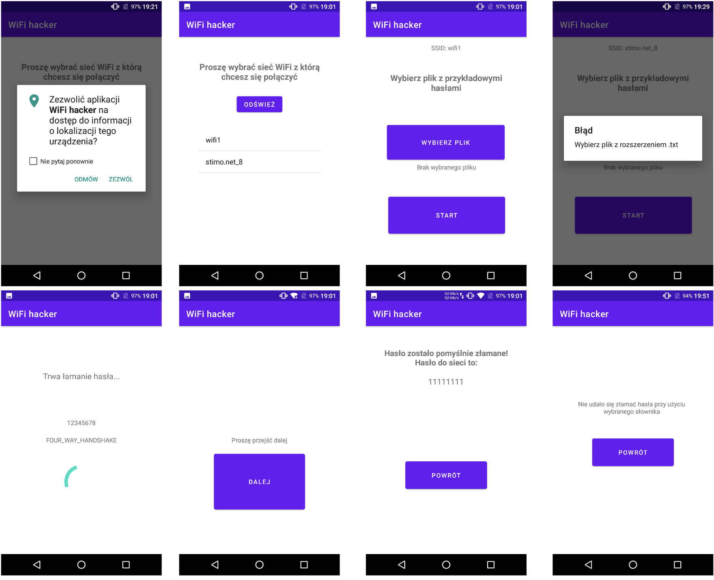

# wifihackerapp
Dictionary attack on WiFi network password.

## Table of contents
* [General info](#general-info)
* [Features](#features)
* [Technologies](#technologies)
* [Setup](#setup)
* [Screenshots](#screenshots)

## General info
"WiFi Hacker" was made as a part of "Security of Computer Software and Penetration Tests" (Bezpieczeństwo oprogramowania i testy penetracyjne) course at Warsaw University of Technology, Faculty of Electronics and Information Technology. 
The goal of the project is to implement an Android application for cracking WiFi network passwords. 
A dictionary attack was chosen to achieve this goal. 
Dictionary attack consists of authentication attempts using previously generated passwords. This could be, for example, a set of the most popular passwords.

## Features
* see list of WiFi networks in device range and select network to attack
* select txt file with passwords using native file selection (instead of hard-coded path)
* see detailed status of wireless connection
  * DISCONNECTED - This state indicates that client is not associated, but is likely to start looking for an access point.
  * ASSOCIATING - Trying to associate with a BSS/SSID.
  * ASSOCIATED - Association completed.
  * FOUR_WAY_HANDSHAKE - WPA 4-Way Key Handshake in progress.
  * GROUP_HANDSHAKE - WPA Group Key Handshake in progress.
  * COMPLETED - All authentication completed.

(see details in docs: https://developer.android.com/reference/android/net/wifi/SupplicantState)
* show found correct password and save network in device settings

## Technologies
Project is created with:
* Kotlin language
* Android Studio
* Android API 30 (Android 11)
* API 16 (Android 4.1) is required

Application tries to connect selected network using passwords from file using WifiManager class. It is available in android.net.wifi package. SSID and password of network is being set, and then addNetwork metod is called.
	
## Setup
Project can be run using Android Studio. It is not possible to test it using virtual device. Because possibility of managing wifi connection in used way was removed in API 29 (Android 10), app may not operate properly on new smartphones.  
Tested devices:
* Huawei P8 Lite (Lineage OS, Android 7.1.2) - works ok
* Xiaomi Redmi Note 9 Pro (MIUI, Android 10) - issues

## Screenshots

